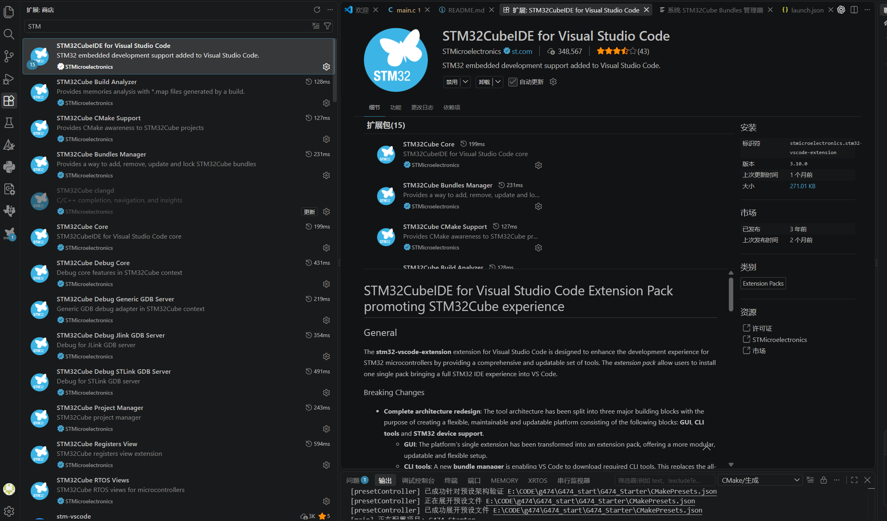
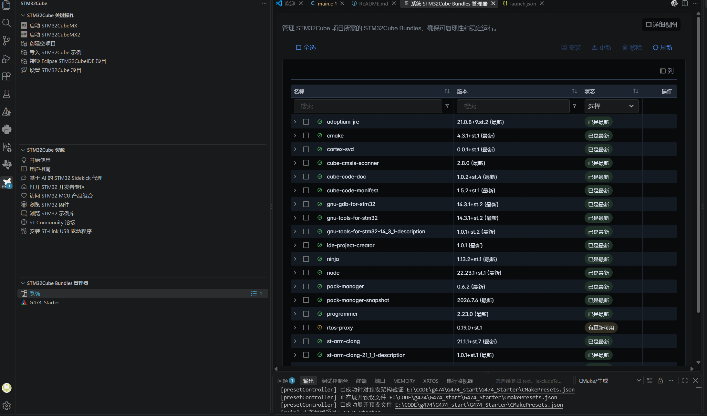
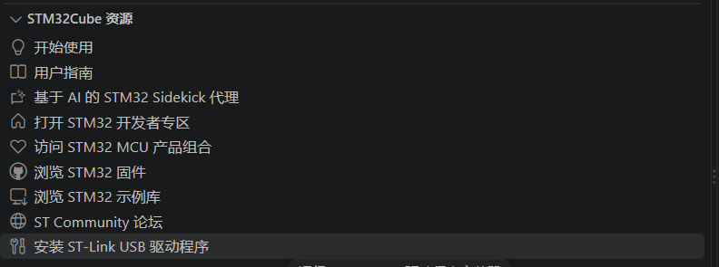
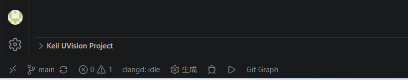

# STM32G474 Starter：第一次编译、烧录与运行

这是一个面向 STM32 初学者的可运行样板工程：先学会打开、编译和烧录，再通过 OLED 菜单逐项学习 GPIO、I2C、SPI、UART、TIM 和经典 CAN。

> 第一次使用只做 7 件事：安装 VS Code → 安装 ST 官方扩展 → 下载工具包和 ST-LINK 驱动 → 打开正确目录 → 接好 SWD → Build → 按 F5 下载。

- [外设原理与代码教学](docs/PERIPHERALS.md)
- [详细故障排查](docs/TROUBLESHOOTING.md)
- [公开仓库主页](https://github.com/kirin520/G474_Starter)

> 安全提示：上电不会自动写 FRAM 或 SD。只有进入对应菜单并短按 PC2 才会测试写入。`SD Card Test` 会覆盖 SD 卡根目录中的 `G474_DEMO.TXT`。

## 1. 先认识工程目录

第一次打开工程时，先不要逐个阅读几百个文件。只需记住：应用流程在 `main.c`，自己写的驱动在 `User/`，引脚和外设参数应回到 `.ioc` 修改。

修改规则：

- **绿色——可以修改：** 教程、`User/` 驱动和 CMake 用户源码列表。
- **橙色——只改 USER CODE：** `Core/Src/main.c` 中 `USER CODE BEGIN/END` 之间的内容。
- **蓝色——通过 CubeMX 修改：** `.ioc` 是配置源，`Core/` 中大部分文件由它生成。
- **灰色——先阅读，不建议修改：** ST 的 HAL/CMSIS 和 FatFs 第三方源码。

| 路径 | 它负责什么 | 初学者怎么做 |
|---|---|---|
| [`Core/Src/main.c`](Core/Src/main.c) | 启动顺序、OLED 菜单、主循环、按键和 UART 回调 | **第一个阅读**；只改 USER CODE 区域 |
| [`User/Inc`](User/Inc) | 用户驱动对外接口，也就是“有哪些函数可以调用” | 先看 `.h`，再看同名 `.c` |
| [`User/Src`](User/Src) | OLED、FRAM、SD、编码器、CAN 的实现 | 适合阅读和修改 |
| [`Core/Src`](Core/Src) | CubeMX 生成的 GPIO、I2C、SPI、UART、TIM、FDCAN 初始化 | 可以阅读；参数回 `.ioc` 修改 |
| [`Drivers`](Drivers) | ST 官方 HAL 和 CMSIS 库 | 不要修改 |
| [`ThirdParty/FatFs`](ThirdParty/FatFs) | SD 卡 FAT 文件系统 | 先当作库使用 |
| [`G474_Starter.ioc`](G474_Starter.ioc) | MCU 型号、引脚、时钟和外设配置源 | 用 CubeMX 修改硬件配置 |
| [`CMakeLists.txt`](CMakeLists.txt) | 告诉 CMake 要编译哪些用户源码、去哪里找头文件 | 新增 `.c` 文件时需要更新 |
| [`CMakePresets.json`](CMakePresets.json) | 定义 `Debug` 和 `Release` 构建方式 | 初学阶段选择 `Debug` |
| [`.vscode/launch.json`](.vscode/launch.json) | ST-LINK 下载/调试配置 | 通常不用改 |
| [`.settings/bundles.store.json`](.settings/bundles.store.json) | 锁定本工程需要的编译、调试工具版本 | 交给 Bundle Manager |
| [`STM32G474XX_FLASH.ld`](STM32G474XX_FLASH.ld) | Flash、RAM 地址和程序段布局 | 只读学习 |
| [`startup_stm32g474xx.s`](startup_stm32g474xx.s) | 中断向量表和复位入口 | 只读学习 |

推荐阅读顺序：`main.c` → `User/Inc/oled.h` → `User/Src/oled.c` → 其他感兴趣的驱动。协议细节见[外设教学分册](docs/PERIPHERALS.md)。

## 2. 配置 Windows 开发环境

### 先看官方安装视频

第一次配置环境，建议先完整观看下面的视频。点击封面会跳转到 Bilibili：

[](https://www.bilibili.com/video/BV1JJ2cBHE2f/)

> 视频：[STM32CubeIDE for Visual Studio Code 安装](https://www.bilibili.com/video/BV1JJ2cBHE2f/)，发布者：意法半导体中国，时长约 6 分 49 秒。视频负责展示真实界面；下文负责说明本工程具体需要哪些工具、版本和检查项。

主流程仅使用 Windows 10/11、VS Code、STM32CubeMX、ST 官方扩展和 ST-LINK。先看懂各软件的分工，再开始安装：

| 软件或工具 | 它做什么 | 第一次编译是否必需 |
|---|---|---|
| VS Code | 编辑代码，提供统一操作界面 | 必需 |
| STM32CubeIDE for Visual Studio Code | 让 VS Code 识别、构建和调试 STM32 工程 | 必需 |
| STM32CubeMX | 修改 `.ioc` 中的引脚、时钟和外设，并重新生成代码 | 只编译现有工程时可不装；二次开发建议安装 |
| CMake | 根据 `CMakeLists.txt` 生成 Ninja 构建规则 | 必需，由 Bundle Manager 安装 |
| Ninja | 按构建规则调用编译器 | 必需，由 Bundle Manager 安装 |
| GNU Tools for STM32 | 把 C/汇编编译、链接成 ELF，并提供 GDB | 必需，由 Bundle Manager 安装 |
| ST-LINK GDB Server | 连接 GDB 与 ST-LINK | 调试时必需 |
| STM32CubeProgrammer | 把 ELF 写入 MCU Flash | 下载时必需 |
| ST-LINK USB 驱动 | 让 Windows 正确识别 ST-LINK | 必需，需要手动安装 |

> 一些旧教程使用 STM32CubeCLT、旧版 STM32 VS Code Extension 2.x 和 Cortex-Debug 手工路径。它们的原理仍有参考价值，但本工程使用官方扩展 3.x 的 Bundle Manager，不要再照着旧教程重复安装工具链或覆盖当前 `launch.json`。

### 2.1 安装 VS Code

1. 从 [Visual Studio Code 官方下载页](https://code.visualstudio.com/download)下载安装包。
2. 正常完成安装并启动 VS Code。
3. 如果已安装，可直接使用；不要求把编译器手工加入 `PATH`。

### 2.2 安装 STM32CubeMX

1. 从 [ST 官方 STM32CubeMX 页面](https://www.st.com/en/development-tools/stm32cubemx.html) 下载安装。
2. 第一次启动时按提示登录 ST 账号并安装 STM32G4 Firmware Package。
3. 双击 [`G474_Starter.ioc`](G474_Starter.ioc)，确认 CubeMX 能正常打开本工程。

如果你现在只想编译和烧录仓库中已经生成好的代码，可以暂时跳过 CubeMX；当你需要修改引脚、时钟或外设参数时再安装。不要在 `gpio.c`、`spi.c` 等生成文件中硬改参数。

### 2.3 安装 ST 官方扩展

1. 点击 VS Code 左侧 **Extensions（扩展）** 图标，或按 `Ctrl+Shift+X`。
2. 搜索 `STM32CubeIDE for Visual Studio Code`。
3. 确认发布者是 **STMicroelectronics**，安装 3.x 版本。
4. 安装完成后重启 VS Code。



扩展的官方名称、要求和更新说明以 [VS Code Marketplace](https://marketplace.visualstudio.com/items?itemName=stmicroelectronics.stm32-vscode-extension) 为准。

### 2.4 用 Bundle Manager 下载工程工具

安装扩展不等于已经拥有编译器。点击左侧 STM32Cube 图标，打开 **STM32Cube Bundles Manager**，让它按本工程的 `.settings/bundles.store.json` 安装以下工具：

| 工具 | 本工程锁定版本 | 用途 |
|---|---:|---|
| CMake | `4.3.1+st.1` | 生成构建规则 |
| Ninja | `1.13.2+st.1` | 执行快速构建 |
| GNU Tools for STM32 | `14.3.1+st.2` | 编译、链接和 GDB |
| ST Arm Clangd | `21.1.0+st.2` | 代码跳转与错误提示 |
| STM32CubeProgrammer | `2.23.0` | 下载程序 |
| ST-LINK GDB Server | `7.14.0+st.2` | 在线调试 |



工具包较大，第一次下载需要等待。全部项目显示为已安装后再打开工程。详细步骤参见 [ST 官方安装文档](https://dev.st.com/stm32cube-docs/stm32cubeide-vscode/latest/en/docs/markup/getting_started/installation.html)。

### 2.5 安装 ST-LINK USB 驱动

Windows 驱动目前仍可能需要管理员权限手动安装：

1. 在 STM32Cube 侧栏找到 **ST-Link USB Drivers** 入口。
2. 选择适合 Windows 的驱动安装程序，以管理员身份完成安装。
3. 插入 ST-LINK，打开 Windows **设备管理器**。
4. 在 USB 设备中确认存在 ST-LINK，且没有黄色感叹号。



如果电脑能识别 ST-LINK、但提示 `No target found`，通常不是 USB 驱动问题，而是开发板供电、SWD 接线、复位或芯片侧连接问题。

### 2.6 安装完成后的检查清单

在继续之前逐项确认：

- VS Code 的扩展页面显示 `STM32CubeIDE for Visual Studio Code` 已安装。
- Bundle Manager 中本工程要求的 6 个工具均为 Installed/Ready。
- 设备管理器能看到 ST-LINK，且没有黄色感叹号。
- 若需要修改 `.ioc`，STM32CubeMX 能打开工程并识别 STM32G474VET6。
- 不需要手工配置系统 `PATH`，也不要把其他 GCC、CMake 或 OpenOCD 路径写进本工程。

## 3. 下载并打开工程

### 方法 A：下载 ZIP

1. 打开 [GitHub 仓库](https://github.com/kirin520/G474_Starter)。
2. 点击 **Code → Download ZIP**。
3. 完整解压后再打开，不要直接在压缩包预览器中编译。

### 方法 B：使用 Git

```powershell
git clone https://github.com/kirin520/G474_Starter.git
cd G474_Starter
```

在 VS Code 中选择 **File → Open Folder**，打开同时包含以下文件的目录：

```text
G474_Starter.ioc
CMakeLists.txt
CMakePresets.json
Core/
User/
```

最常见的错误是只打开 `Core`、`User` 或外面多一层的下载目录。判断方法很简单：VS Code 资源管理器顶层应直接看见 `.ioc` 和 `CMakeLists.txt`。

若没有自动识别工程，按 `Ctrl+Shift+P`，运行 **STM32Cube: Set up STM32Cube projects**（部分 3.x 界面称为 Discover/Configure STM32Cube project），然后选择当前项目。

## 4. 连接 ST-LINK

先断电接线，核对后再给开发板供电。

| ST-LINK | 开发板 | 作用 |
|---|---|---|
| `VTref` / `3V3` | 板卡 `3.3V` | 告诉下载器目标电平 |
| `GND` | `GND` | 必须共地 |
| `SWDIO` | `PA13` | 双向调试数据 |
| `SWCLK` | `PA14` | 调试时钟 |
| `NRST` | `NRST` | 推荐连接，便于 Under Reset 连接 |

> `VTref` 通常是目标电压参考，不应默认把它当作开发板电源。开发板应使用可靠的 3.3 V 电源，并确保 MCU、ST-LINK 与外设共地。不要把 5 V 直接接到 3.3 V MCU 信号脚。

## 5. 第一次编译

### 5.1 选择 Debug preset

1. 打开 VS Code 底部状态栏或 CMake 面板。
2. 选择 **Configure Preset: Debug**。
3. 点击 **Configure**，等待生成 `build/Debug`。
4. 点击底部状态栏的 **生成（Build）**。



图中只需要关注齿轮右侧的“生成”按钮。左侧显示的项目分组名称会随当前工作区变化，不影响本工程的构建操作。

编译成功的关键标志是：没有 `error`，并生成：

```text
build/Debug/G474_Starter.elf
```

也可以在工程根目录使用命令行：

```powershell
cmake --preset Debug
cmake --build --preset Debug --clean-first --parallel
```

若没有 ELF，先解决输出窗口中出现的**第一条错误**，不要只看最后一行。

## 6. 用 VS Code 下载和调试

1. 保持 ST-LINK 与开发板连接并给板卡供电。
2. 点击左侧 **Run and Debug**，或按 `Ctrl+Shift+D`。
3. 选择仓库自带的 `STM32Cube: Launch ST-Link GDB Server`。
4. 按 `F5`。扩展会先构建，再下载 ELF，最后在 `main()` 停住。
5. 看到黄色执行箭头停在 `main()` 是正常现象；再按一次 `F5` 才会继续运行。

本工程调试项来自 [`.vscode/launch.json`](.vscode/launch.json)，其中 `runEntry` 设置为 `main`，所以首次进入调试会主动停在这里。官方调试说明见 [ST Debug 文档](https://dev.st.com/stm32cube-docs/stm32cubeide-vscode/latest/en/docs/markup/development/debug.html)。

### 备用方法：STM32CubeProgrammer GUI

VS Code 调试暂时不可用时，可以使用 [STM32CubeProgrammer](https://www.st.com/en/development-tools/stm32cubeprog.html)：

1. 连接方式选择 **ST-LINK**，端口选择 **SWD**。
2. 点击 **Connect**。
3. 在下载页面选择 `build/Debug/G474_Starter.elf`。
4. 点击 **Download**，完成后点击 **Reset** 或给板卡重新上电。

## 7. 第一次运行

继续运行或复位后，OLED 应显示标题 `G474 DEMO MENU` 和菜单列表。

操作方式：

- 旋转编码器：上下选择菜单项。
- PC2 短按：进入菜单项，或执行当前测试。
- PC2 长按 800 ms：返回主菜单。
- PC13 编码器自带按键和 SD 卡插入检测在当前版本中不使用。

推荐按以下顺序验证：

1. `LED Test`：PB11 每 500 ms 闪烁，注意它是**低电平点亮**。
2. `Key Test`：每次 PC2 短按只增加一次。
3. `Encoder Test`：确认正反转和方向。
4. `DIP Switch`：拨动 SW_1、SW_2 查看状态。
5. `System Status`：查看 OLED、FRAM、SPI 和 CAN 状态。
6. 最后再测试 FRAM、SD、UART 和 CAN。

各菜单页面的硬件连接、CubeMX 配置、最小代码和练习都在[外设原理与代码教学](docs/PERIPHERALS.md)。

## 8. 首装常见问题

| 现象 | 先检查什么 |
|---|---|
| `No target found` | 板卡是否有 3.3 V、VTref、共地、PA13/PA14 是否接反、NRST 是否连接 |
| 没有生成 ELF | 是否打开工程根目录、Bundle 是否完整、是否选中 Debug、第一条编译错误是什么 |
| VS Code 未发现工程 | 根目录是否直接包含 `.ioc` 和 `CMakeLists.txt`；运行 Set up/Discover STM32Cube project |
| Windows 不识别 ST-LINK | 重新安装 ST-LINK USB 驱动，检查设备管理器和 USB 线 |
| 下载后停在 `main()` | 正常；调试配置要求停在 `main`，再按一次 F5 |
| OLED 没有菜单 | 确认程序已继续运行，再检查 I2C4、0x3C、3.3 V 和上拉 |

需要逐项定位时，请转到[详细故障排查](docs/TROUBLESHOOTING.md)。

## 9. 下一步学什么

- 想看“每个外设是什么、代码从哪里开始读”：打开 [docs/PERIPHERALS.md](docs/PERIPHERALS.md)。
- 遇到 ST-LINK、Default_Handler、SD、UART 或 CAN 问题：打开 [docs/TROUBLESHOOTING.md](docs/TROUBLESHOOTING.md)。
- 想改引脚或时钟：打开 [`G474_Starter.ioc`](G474_Starter.ioc)，在 CubeMX 修改并重新生成；自定义代码应放在 `USER CODE` 区域或 `User/`。

## 10. 参考与图片说明

环境章节参考了以下资料，并按当前官方扩展 3.x 和本工程的 Bundle Manager 配置重新核对：

- [ST 官方安装文档](https://dev.st.com/stm32cube-docs/stm32cubeide-vscode/latest/en/docs/markup/getting_started/installation.html)
- [ST 官方调试文档](https://dev.st.com/stm32cube-docs/stm32cubeide-vscode/latest/en/docs/markup/development/debug.html)
- [意法半导体中国：STM32CubeIDE for Visual Studio Code 安装（视频）](https://www.bilibili.com/video/BV1JJ2cBHE2f/)
- [码工许师傅：搭建基于 ST 官方 VS Code 扩展的 STM32 开发环境](https://blog.csdn.net/xusiwei1236/article/details/141504722)
- [black_sneak：VS Code STM32 入门文章](https://blog.csdn.net/black_sneak/article/details/157097181)

第三篇文章采用 CC BY-SA 4.0，但其截图对应旧版扩展、STM32CubeCLT 和另一块 MCU 板卡。为了避免初学者把旧界面、H7 引脚或手工工具路径套到本工程，当前仓库没有复制这些旧截图。README 中的 VS Code 截图由本项目维护者从当前环境实际截取。
